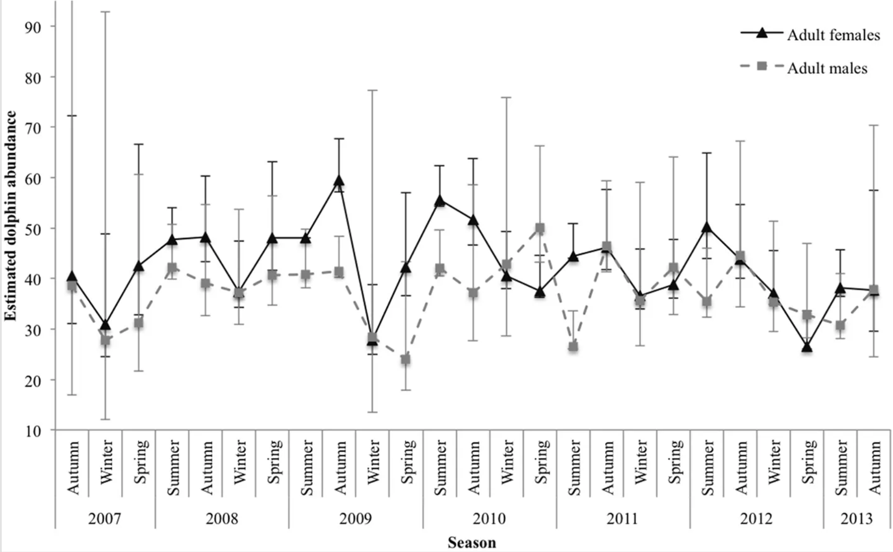

## Original figure and visual critique



Message:

The original figure shows how the estimated abundance of adult female and male Indo-Pacific bottlenose dolphins varied across seasons and years from 2007 to 2013.

Flaws:

The original x-axis is overcrowded because every season is labelled vertically across multiple years, making the figure difficult to read quickly. The black and grey styling also makes the two sex groups harder to distinguish, especially where the lines overlap. In addition, the large error bars create visual clutter and compete with the abundance trends themselves.

## Plot reconstruction

```{r}
# Load packages needed for data wrangling, plotting, and project file paths
library(tidyverse)
library(here)
```

```{r}
# Import the digitised dolphin abundance data
dolphin_data <- read_csv(
  here("data", "workshop 3", "dolphin_abundance_digitised.csv"))

# Inspect the imported data structure
glimpse(dolphin_data)
```

```{r}
# Label the first 25 digitised points as females and the next 25 as males
dolphin_clean <- dolphin_data |>
  mutate(
    sex = if_else(row_number() <= 25, "Adult females", "Adult males"),
    position = round(x))

# Check the cleaned data
glimpse(dolphin_clean)
head(dolphin_clean)
tail(dolphin_clean)
```

```{r}
# Assign each digitised point to its correct sampling period
dolphin_clean <- dolphin_clean |>
  group_by(sex) |>
  mutate(
    time_index = row_number(),
    year = c(rep(2007:2012, each = 4), 2013),
    season = c(rep(c("Autumn", "Winter", "Spring", "Summer"), 6), "Autumn")) |>
  ungroup()

# Check that the year and season labels were assigned correctly
dolphin_clean |>
  select(sex, time_index, year, season, y) |>
  head(10)
```

```{r}
# Rename the digitised abundance values and create an ordered sampling-period label
dolphin_clean <- dolphin_clean |>
  rename(
    abundance = y) |>
  mutate(
    sampling_period = paste(season, year),
    sampling_period = factor(
      sampling_period,
      levels = unique(sampling_period)))

# Check the final plotting variables
dolphin_clean |>
  select(sex, year, season, sampling_period, abundance) |>
  head(10)
```

```{r}
# Create a numeric time variable so seasons can be plotted within each year
dolphin_plot <- dolphin_clean |>
  mutate(
    time_numeric = year +
      case_when(
        season == "Autumn" ~ 0,
        season == "Winter" ~ 0.25,
        season == "Spring" ~ 0.50,
        season == "Summer" ~ 0.75))

# Reconstruct the dolphin abundance figure with a cleaner and more accessible design
ggplot(
  dolphin_plot,
  aes(
    x = time_numeric,
    y = abundance,
    colour = sex,
    group = sex)) +
  geom_line(linewidth = 0.8) +
  geom_point(
    aes(shape = season),
    size = 2.5) +
  scale_colour_viridis_d() +
  scale_x_continuous(
    breaks = 2007:2013) +
  labs(
    title = "Seasonal abundance of Indo-Pacific bottlenose dolphins",
    x = "Year",
    y = "Estimated abundance",
    colour = "Sex",
    shape = "Season") +
  theme_minimal() +
  theme(
    legend.position = "bottom")
```

## Reconstructed figure

**Improvement approach:**\
The figure was redesigned to make the temporal patterns easier to interpret by simplifying the x-axis, using contrasting colours for sex, and using different point shapes to retain seasonal information.

```{r}
# Create a cleaner publication-style plot with improved colours and legend layout
ggplot(
  dolphin_plot,
  aes(
    x = time_numeric,
    y = abundance,
    colour = sex,
    group = sex)) +
  geom_line(linewidth = 0.9) +
  geom_point(
    aes(shape = season),
    size = 2.7) +
  scale_colour_manual(
    values = c(
      "Adult females" = "#2C7FB8",
      "Adult males" = "#E76F51")) +
  scale_shape_manual(
    values = c(
      "Autumn" = 16,
      "Winter" = 17,
      "Spring" = 15,
      "Summer" = 18)) +
  scale_x_continuous(
    breaks = 2007:2013) +
  labs(
    title = "Seasonal abundance of Indo-Pacific bottlenose dolphins",
    subtitle = "Estimated abundance of adult females and males from 2007–2013",
    x = "Year",
    y = "Estimated dolphin abundance",
    colour = "Sex",
    shape = "Season",
    caption = "Approximate abundance values were extracted from the published figure using PlotDigitizer.") +
  theme_minimal(base_size = 12) +
  theme(
  panel.grid.minor = element_blank(),
  legend.position = "right",
  legend.box = "vertical",
  legend.title = element_text(face = "bold"),
  plot.title = element_text(face = "bold")) +
guides(
  colour = guide_legend(
    order = 1),
  shape = guide_legend(
    order = 2))
```

**Figure caption:**\
Estimated seasonal abundance of adult female and male Indo-Pacific bottlenose dolphins from 2007 to 2013. Contrasting colours distinguish sex, while point shapes indicate season. Approximate abundance values were extracted from the published figure using PlotDigitizer.
